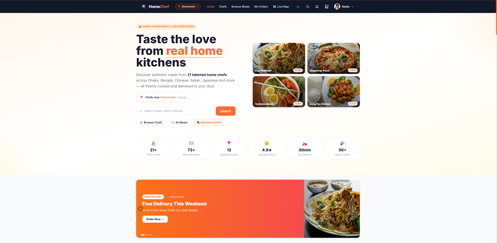
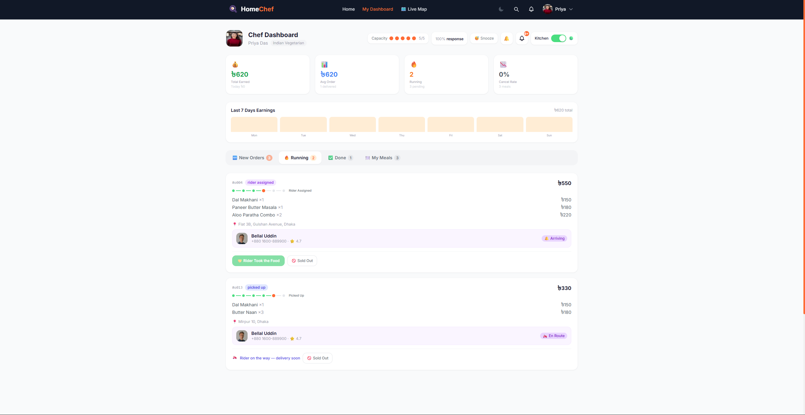

# 🍳 HomeChef Marketplace

> A full-stack-style React web app connecting home chefs, customers, and delivery riders — built with Vite, React 18, Tailwind CSS, and React Router.

<!-- Replace the URL below once deployed -->
🌐 **Live Demo:** `https://your-live-url-here.com`

---

## 📸 Screenshots

| Customer Home | Chef Dashboard | Rider Dashboard |
|---|---|---|
|  |  |  |

---

## ✨ Features

### 👤 Customer
- Browse home chefs by area and cuisine
- Add meals to cart with customization options
- Checkout with wallet, promo codes & loyalty stamps
- Live order tracking with map view
- Order history, reviews, and notifications
- Favourite chefs and meals

### 👨‍🍳 Chef
- Full dashboard: manage menu, orders, availability
- Analytics: revenue, ratings, top meals
- Accept / reject incoming orders
- Profile page with cuisine tags and reviews

### 🛵 Rider *(v11 — fully featured)*
- **Online / Offline toggle** — stop receiving tasks with one tap
- **Live map** — animated Leaflet map showing pickup → drop-off route
- **Task feed** — real-time spawning with surge/boost badges (⚡🔥💎)
- **Skip / Reject** tasks without penalty
- **In-app notifications** — bell badge + audio chime for high-value orders
- **Security code** delivery confirmation
- **Photo proof** — camera capture on delivery
- **Customer contact** — one-tap call button
- **Earnings panel** — 7-day bar chart, payout history, withdraw flow
- **Ratings panel** — star distribution, per-delivery feedback
- **Profile settings** — vehicle type, phone, payment account (bKash/Nagad)
- **History filters** — All Time / Today / This Week

---

## 🚀 Getting Started

### Prerequisites

- Node.js ≥ 18
- npm ≥ 9

### Installation

```bash
# 1. Clone the repo
git clone https://github.com/your-username/homechef-marketplace.git
cd homechef-marketplace/homechef-v5

# 2. Install dependencies
npm install

# 3. Start the dev server
npm run dev
```

The app will be available at `http://localhost:5173`.

### Build for Production

```bash
npm run build
npm run preview   # preview the production build locally
```

---

## 🔐 Demo Credentials

Use the **Demo Login** buttons on the login page, or enter manually:

| Role | Email | Password |
|------|-------|----------|
| 🛵 Rider | `rakib@rider.com` | `rider123` |
| 👨‍🍳 Chef | `rashida@chef.com` | `chef123` |
| 👤 Customer | `rifat@customer.com` | `customer123` |

---

## 🗂 Project Structure

```
homechef-v5/
├── src/
│   ├── components/          # Shared UI components
│   │   ├── Navbar.jsx
│   │   ├── Footer.jsx
│   │   ├── LiveTrackingMap.jsx
│   │   ├── Toast.jsx
│   │   └── ...
│   ├── context/             # React context providers
│   │   ├── AuthContext.jsx
│   │   ├── CartContext.jsx
│   │   └── FavoritesContext.jsx
│   ├── data/                # Static JSON data (mock backend)
│   │   ├── users.json       # 30 users (chefs, customers, riders)
│   │   ├── meals.json       # Full meal catalogue
│   │   ├── chefs.json       # Chef profiles with location data
│   │   ├── orders.json      # Seed orders
│   │   └── areas.json       # Delivery zones (Dhaka)
│   ├── pages/               # Route-level page components
│   │   ├── Home.jsx
│   │   ├── RiderDashboard.jsx
│   │   ├── ChefDashboard.jsx
│   │   ├── OrderTracker.jsx
│   │   ├── Checkout.jsx
│   │   └── ...
│   ├── App.jsx              # Routes + layout
│   ├── main.jsx
│   └── index.css            # Tailwind + custom styles
├── index.html
├── vite.config.js
├── tailwind.config.js
└── package.json
```

---

## 🛠 Tech Stack

| Layer | Technology |
|-------|-----------|
| Framework | React 18 |
| Build tool | Vite 5 |
| Routing | React Router v6 |
| Styling | Tailwind CSS v3 |
| Maps | Leaflet 1.9 (CDN) |
| State | React Context + localStorage |
| Data | JSON |

---

## 🗺 Pages & Routes

| Route | Access | Description |
|-------|--------|-------------|
| `/` | Customer, Chef | Home / listings |
| `/listings` | Customer, Chef | Browse all meals |
| `/chefs` | Customer, Chef | Chef directory |
| `/chef/:id` | Customer, Chef | Chef profile |
| `/cart` | Customer | Shopping cart |
| `/checkout` | Customer | Place order |
| `/order-tracker/:id` | All | Live order tracking |
| `/orders` | Customer | Order history |
| `/chef-dashboard` | Chef | Chef management panel |
| `/rider-dashboard` | Rider | Rider task feed |
| `/profile` | All | User profile |
| `/notifications` | All | Notification centre |
| `/reviews` | Customer | Leave reviews |
| `/become-a-chef` | Public | Chef application |
| `/admin/map` | All | Admin map view |
| `/login` | Public | Login page |

---

## 📦 Data & State

All data is stored in `/src/data/*.json` and `localStorage` — there is no backend. State flows through:

- **AuthContext** — current user, login/logout, area selection
- **CartContext** — cart items, totals, promo codes
- **FavoritesContext** — favourited chefs/meals
- **localStorage** — orders, wallet, stamps, rider settings, online status

---

## 🤝 Contributing

1. Fork the repo
2. Create a feature branch: `git checkout -b feature/my-feature`
3. Commit your changes: `git commit -m 'Add my feature'`
4. Push to the branch: `git push origin feature/my-feature`
5. Open a Pull Request

---

## 📄 License

MIT © 2026 HomeChef Marketplace
